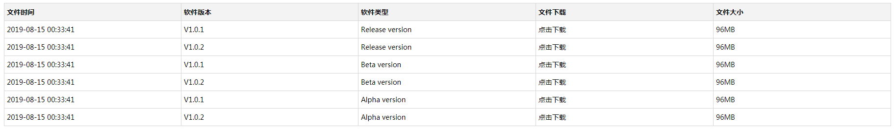

# 需求

> 日期：2019年10月06日
>
> 地址：https://www.v2ex.com/t/606597

 

抱歉，刚才没时间来得及编辑需求，现在补上。

需要转换的数据源是一个 yml 文件，里面储存了多个软件的历史版本，其内容格式如下：  

```
pgdlzv:
V1.0.1: http://lg.la.ramnode.com/static/100MB.test
V1.0.2: http://lg.la.ramnode.com/static/1000MB.test
- pgdlzv_beta_ver:
V1.0.1: http://lg.la.ramnode.com/static/100MB.test
V1.0.2: http://lg.la.ramnode.com/static/1000MB.test
- pgdlzv_alpha_ver:
V1.0.1: http://lg.la.ramnode.com/static/100MB.test
V1.0.2: http://lg.la.ramnode.com/static/1000MB.test
- bdlxri:
V1.0.1: http://lg.la.ramnode.com/static/100MB.test
V1.0.2: http://lg.la.ramnode.com/static/1000MB.test
- bdlxri_beta_ver:
V1.0.1: http://lg.la.ramnode.com/static/100MB.test
V1.0.2: http://lg.la.ramnode.com/static/1000MB.test
- bdlxri_alpha_ver:
V1.0.1: http://lg.la.ramnode.com/static/100MB.test
V1.0.2: http://lg.la.ramnode.com/static/1000MB.test
```

  上面摘录了一小部分，实际上还有很多内容（格式相同），需要将其转换为 HTML 表格代码，并分别输出到文件。

譬如 pgdlzv、pgdlzv_beta_ver、pgdlzv_alpha_ver 输出到同一文件（文件名为 pgdlzv，也就是开头相同的部分）。

表格格式如下图：



表格里各项数据获取来源说明：

“文件时间”：可使用 curl -I 获取链接文件的 Last-Modified
“软件版本”：取自源文件里的版本号
“软件类型”：取自源文件里的段落第一行字符串，不过这里要做个替换，比如 pgdlzv 替换为 Release version，pgdlzv_beta_ver 替换为 Beta version，pgdlzv_alpha_ver 替换为 Alpha version
“文件下载”：取自源文件里的下载链接，加一个 <a> 超链接
“文件大小”：可使用 curl -I 获取链接文件的 Content-Length  